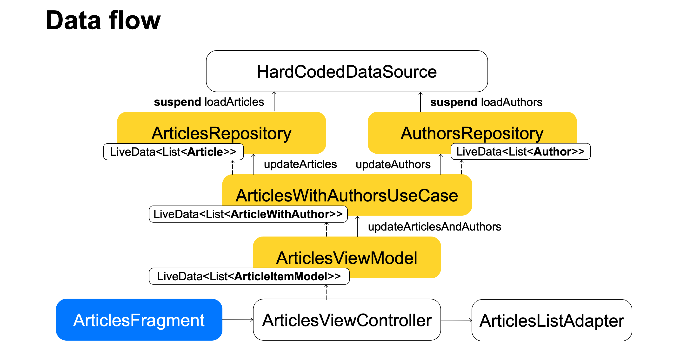

# Showcase repository for android application architecture

This is a project that accompanies a lecture on software architecture. The 2022 recording is available [on YouTube](https://youtu.be/2YsfMTqsKEs). The description of this app starts with [this slide](https://youtu.be/2YsfMTqsKEs?t=4410).
This is a simple application that contains a list of articles. You can bookmark or delete each article. The list of articles and their authors are loaded asynchronously and combined using the author id.

## !!!WARNING!!!
- The project is structured by architecture layers, i.e. there are folders *data*, *domain* and *ui*. This is done for demonstration purposes, and this is **not** how we usually structure applications. Usually classes are divided into modules by feature, for example, all classes associated with an article will be located in the *article* folder, and, as a rule, there will be fewer folders, and the project structure will be flatter.
- This lecture precedes a lecture on Dependency Injection, so all the code related to DI is written manually. In real projects, DI frameworks should be used to avoid boilerplate code. The most popular choice for large projects is [Dagger 2](https://dagger.dev/).
# Data flow

Data is loaded from the [`HardCodedDataSource`](app/src/main/java/com/example/architecture/data/datasource/HardCodedDataSource.kt). It uses delays to simulate asynchhronous loading.
Repositories ([`ArticleRepository`](app/src/main/java/com/example/architecture/data/repository/ArticleRepository.kt) and [`AuthorRepository`](app/src/main/java/com/example/architecture/data/repository/AuthorRepository.kt)) are responsible for retreiving the data from data source and caching it into `LiveData`s.
([ArticlesWithAuthorsUseCase](app/src/main/java/com/example/architecture/domain/usecases/ArticlesWithAuthorsUseCase.kt) is observing `LiveData`s from the repositories and merges them into one `LiveData<ArticlesWithAuthor>` using `MediatorLiveData`.
([`ArticlesViewModel`](app/src/main/java/com/example/architecture/ui/stateholders/ArticlesViewModel.kt) is observing this `MediatorLiveData`. It maps `ArticlesWithAuthor` into `ArticleItemModel` using `Transformations.map` to prepare the data for displaying.
Classes that are displaying data observe the `LiveData` of the `ViewModel`. There is an [`ArticlesFragment`](app/src/main/java/com/example/architecture/ui/view/ArticlesFragment.kt) that delegates most of its work to [`ArticlesViewController`](app/src/main/java/com/example/architecture/ui/view/ArticlesViewController.kt) to move code out of the system-managed classes.
[`ArticlesViewController`](app/src/main/java/com/example/architecture/ui/view/ArticlesViewController.kt) observes changes of the `ViewModel` and pushes new data int [`ArticlesListAdapter`](app/src/main/java/com/example/architecture/ui/view/ArticlesListAdapter.kt).
  

User events and data loading requests are propagated upwards using the usual and `suspend` method calls. Whenever data changes, all classes get their updated version via `LiveData` subscriptions, and the user interface is updated automatically.
A single source of truth ensures that all data is consistent and up-to-date.

# Lifecycles

On the slide each next lifecycle is nested inside the previous one. 
Accessing classes with one lifecycle from the classes with another lifeycle should be done with care to avoid memory leaks.
On the slide, each next lifecycle is nested in the previous one.
# Components

Components are responsible for creating classes, obtaining the required dependencies, and storing references to the created classes. Usually each component is tied to one lifecycle, but there can be multiple components in each lifecycle.
